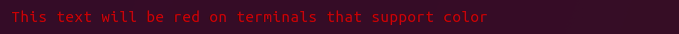
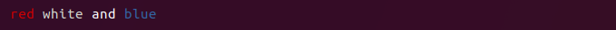
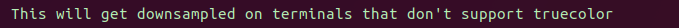

<h1 align="center">Mordant</h1>
<h4 align="center">Dead simple text styling for command-line applications</h3>

> /mɔː(ɹ)dənt/ A substance used to set (i.e. bind) colored dyes on fabrics <sup>[1](https://wikipedia.org/wiki/Mordant)</sup>

Mordant has:

* An easy, configuration-free, API
* Support for nesting styles and colors
* Automatic detection of terminal color support
* Support for 256 and 24-bit colors, with automatic downsampling

<div align="center"></div>

## Usage

```kotlin
val t = TermColors()
println(t.red("This text will be red on terminals that support color"))
```



#### Multiple styles

```kotlin
with(TermColors()) {
    println("${red("red")} ${white("white")} and ${blue("blue")}")
}
```



#### Foreground and background colors

```kotlin
with(TermColors()) {
    println((yellow on brightGreen)("this is easy to read, right?"))
}
```


#### Background color alone

```kotlin
with(TermColors()) {
    println("The foreground ${brightBlue.bg("color will stay the")} same")
}
```


#### Combine styles and colors

```kotlin
with(TermColors()) {
    val style = (bold + white + underline)
    println(style("You can save styles"))
    println(style("to reuse"))
}
```


#### Nest styles and colors

```kotlin
with(TermColors()) {
    println(white("You ${(blue on yellow)("can ${(black + strikethrough)("nest")} styles")} arbitrarily"))
}
```


#### True color and other color spaces
```kotlin
with(TermColors()) {
    println(rgb("#b4eeb4")("This will get downsampled on terminals that don't support truecolor"))
}
```


<p></p>

```kotlin
with(TermColors()) {
    for (v in 0..100 step 4) {
        for (h in 0..360 step 4) {
            print(hsv(h, 100, 100 - v).bg(" "))
        }
        println()
    }
}
```


## Installation

Mordant is distributed with [jitpack](https://jitpack.io/#ajalt/mordant).

First, add Jitpack to your gradle repositories.

```groovy
repositories {
    maven { url "https://jitpack.io" }
}
```

Then add the dependency on mordant.

```groovy
dependencies {
   compile 'com.github.ajalt.mordant:mordant:1.0.0'
}
```

## Related projects

* [Chalk: a JS library that inspired Mordant](https://github.com/chalk)
* [Apache Commons Imaging: which contains color conversion among other functionality](https://commons.apache.org/proper/commons-imaging/index.html)
* [Jansi: a Java library to output ANSI codes](https://github.com/fusesource/jansi)
* [JLine: a Java library to handle console input](https://github.com/jline)

## License

    Copyright 2017 AJ Alt

    Licensed under the Apache License, Version 2.0 (the "License");
    you may not use this file except in compliance with the License.
    You may obtain a copy of the License at

        http://www.apache.org/licenses/LICENSE-2.0

    Unless required by applicable law or agreed to in writing, software
    distributed under the License is distributed on an "AS IS" BASIS,
    WITHOUT WARRANTIES OR CONDITIONS OF ANY KIND, either express or implied.
    See the License for the specific language governing permissions and
    limitations under the License.
