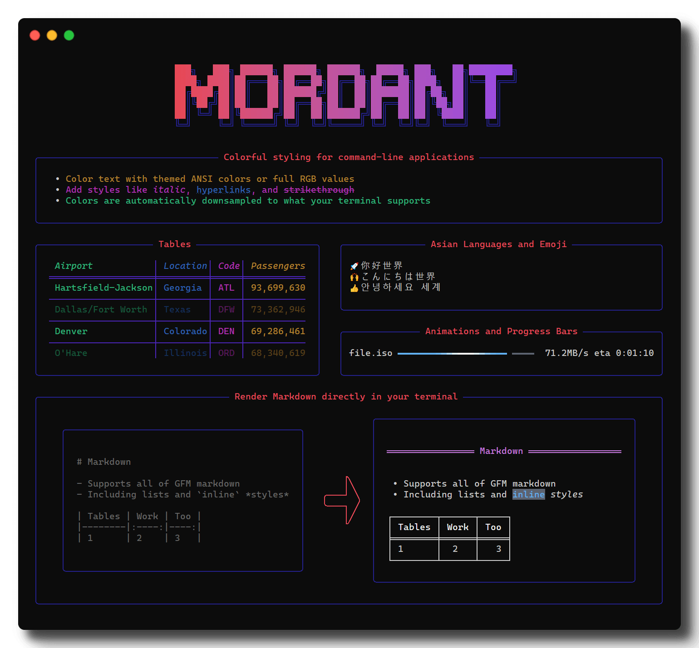

<h1 align="center">
    
</h1>

Mordant is a multiplatform library for rendering styled text in the terminal. You can use it to
add color and style to text, create tables, draw animations, and more.

Mordant has:

* Easy colorful ANSI output with automatic detection of terminal capabilities
* Markdown rendering directly to the terminal
* Widgets for laying out terminal output, including lists, tables, panels, and more
* Support for animating any widget, like progress bars and dashboards

## Documentation

The full documentation can be found on [the website](https://ajalt.github.io/mordant/).

## Installation

Mordant is distributed through Maven Central.

```groovy
dependencies {
   implementation("com.github.ajalt.mordant:mordant:2.3.0")
}
```

###### If you're using Maven instead of Gradle, use `<artifactId>mordant-jvm</artifactId>`

#### Snapshots

<details>
<summary>Snapshot builds are also available</summary>

<a href="https://oss.sonatype.org/content/repositories/snapshots/com/github/ajalt/mordant/mordant/"></a>

<p>
You'll need to add the Sonatype snapshots repository:

```kotlin
repositories {
    maven {
        url = uri("https://oss.sonatype.org/content/repositories/snapshots/")
    }
}
```
</p>
</details>

## License

    Copyright 2018 AJ Alt

    Licensed under the Apache License, Version 2.0 (the "License");
    you may not use this file except in compliance with the License.
    You may obtain a copy of the License at

        http://www.apache.org/licenses/LICENSE-2.0

    Unless required by applicable law or agreed to in writing, software
    distributed under the License is distributed on an "AS IS" BASIS,
    WITHOUT WARRANTIES OR CONDITIONS OF ANY KIND, either express or implied.
    See the License for the specific language governing permissions and
    limitations under the License.
