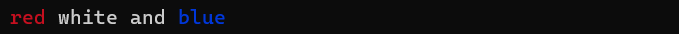
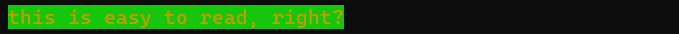
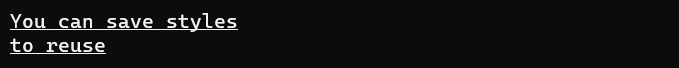
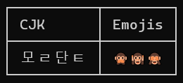
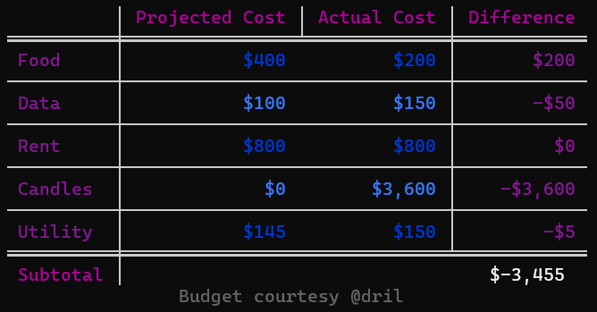
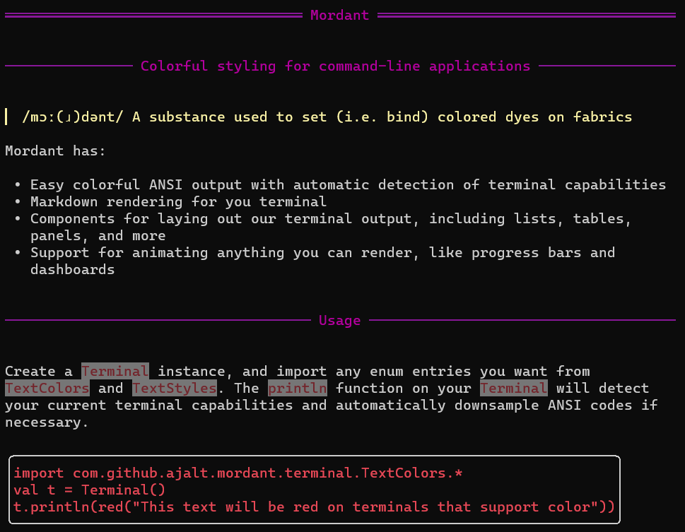
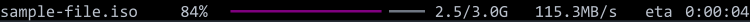

<h1 align="center">Mordant</h1>
<h4 align="center">Colorful styling for command-line applications</h4>

> /mɔː(ɹ)dənt/ A substance used to set (i.e. bind) colored dyes on fabrics <sup>[1](https://wikipedia.org/wiki/Mordant)</sup>

Mordant has:

* Easy colorful ANSI output with automatic detection of terminal capabilities
* Markdown rendering directly to the terminal
* Widgets for laying out terminal output, including lists, tables, panels, and more
* Support for animating any widget, like progress bars and dashboards

## Usage

Create a `Terminal` instance, and import any enum entries you want from `TextColors` and
`TextStyles`. The `println` function on your `Terminal` will detect your current terminal
capabilities and automatically downsample ANSI codes if necessary.

```kotlin
import com.github.ajalt.mordant.rendering.TextColors.*
import com.github.ajalt.mordant.rendering.TextStyles.*

val t = Terminal()
t.println(red("This text will be red on terminals that support color"))
```


#### Multiple styles

```kotlin
import com.github.ajalt.mordant.rendering.TextColors.*
val t = Terminal()
t.println("${red("red")} ${white("white")} and ${blue("blue")}")
```



#### Foreground and background colors

```kotlin
t.println((yellow on brightGreen)("this is easy to read, right?"))
```



#### Background color alone

```kotlin
t.println("The foreground ${brightBlue.bg("color will stay the")} same")
```


#### Combine styles and colors

```kotlin
val style = (bold + white + underline)
t.println(style("You can save styles"))
t.println(style("to reuse"))
```



#### Nest styles and colors

```kotlin
t.println(white("You ${(blue on yellow)("can ${(black + strikethrough)("nest")} styles")} arbitrarily"))
```


#### True color and other color spaces

```kotlin
import com.github.ajalt.mordant.rendering.TextColors.Companion.rgb

t.println(rgb("#b4eeb4")("This will get downsampled on terminals that don't support truecolor"))
```


<p></p>

### Terminal color support detection

By default, `Terminal()` will try to detect ANSI support in the current stdout stream. If you'd
like to override the detection, you can pass a specific value to the `Terminal` constructor.

For example, to always output ANSI RGB color codes, even if stdout is currently directed to a file,
you can do this:

```kotlin
Terminal(AnsiLevel.TRUECOLOR)
```

## Tables

Use the `table` DSL to quickly create tables. Mordant handles ANSI styles and wide characters like
CJK and emoji.

```kotlin
val t = Terminal()
t.println(table {
    header { row("CJK", "Emojis") }
    body { row("모ㄹ단ㅌ", "🙊🙉🙈") }
})
```



Mordant gives you lots of customization for your tables, including striped row styles, row and
column spans, and different border styles.

```kotlin
table {
    borderStyle = SQUARE_DOUBLE_SECTION_SEPARATOR
    align = RIGHT
    outerBorder = false
    column(0) {
        align = LEFT
        borders = ALL
        style = magenta
    }
    column(3) {
        borders = ALL
        style = magenta
    }
    header {
        style(magenta, bold = true)
        row("", "Projected Cost", "Actual Cost", "Difference")
    }
    body {
        rowStyles(blue, brightBlue)
        borders = TOM_BOTTOM
        row("Food", "$400", "$200", "$200")
        row("Data", "$100", "$150", "-$50")
        row("Rent", "$800", "$800", "$0")
        row("Candles", "$0", "$3,600", "-$3,600")
        row("Utility", "$145", "$150", "-$5")
    }
    footer {
        style(bold = true)
        row {
            cell("Subtotal")
            cell("$-3,455") { columnSpan = 3 }
        }
    }
    captionBottom("Budget courtesy @dril", TextStyle(dim = true))
}
```



## Layout

If you need to lay out multiple widgets or strings, you can use the `grid` builder, which has an API similar to `table`,
but doesn't apply styling by default. There are also the `horizontalLayout` and `verticalLayout` builders if you don't
need a full grid.

## Markdown

Mordant can render GitHub Flavored Markdown. Hyperlinks will even be clickable if you're on a
terminal that supports it, like recent versions of iTerm or Windows Terminal.

```kotlin
val t = Terminal()
t.print(Markdown(Path("README.md").readText()))
```



## Controlling the cursor

You can show and hide the cursor, move it around, and clear parts of the screen with the `cursor`
property on `Terminal`. If your terminal doesn't support cursor movements (like when output is
redirected to a file) these commands are no-ops.

```kotlin
val t = Terminal()
t.cursor.move {
    up(3)
    startOfLine()
    clearScreenAfterCursor()
}
t.cursor.hide(showOnExit = true)
```

## Animations

You can animate any widget like a table with `Terminal.animation`, or any regular
string with `Terminal.textAnimation`.

```kotln
val t = Terminal()
val a = t.textAnimation<Int> { frame ->
    (1..50).joinToString("") {
        val hue = (frame + it) * 3 % 360
        TextColors.hsv(hue, 1, 1)("━")
    }
}

t.cursor.hide(showOnExit = true)
repeat(120) {
    a.update(it)
    Thread.sleep(25)
}
``` 


## Progress bars

You can create customizable progress bars that automatically compute speed and time remaining.

```kotlin
val t = Terminal()
val progress = t.progressAnimation {
    text("my-file.iso")
    percentage()
    progressBar()
    completed()
    speed("B/s")
    timeRemaining()
}
```

The `progressAnimation` builder is currently JVM-only. On other platforms, you can still use 
`t.animation { progressLayout { ... } }` which will render the same widget, you'll just need to call `progress.update`
manually.



Call `progress.start` to animate the progress, and `progress.update` or `progress.advance` as your
task completes.

## Prompting for input

You can ask the user to enter text and wait for a response with `Terminal.prompt`:

```kotlin
val t = Terminal()
val response = t.prompt("Choose a size", choices=listOf("small", "large"))
t.println("You chose: $response")
```

```text
$ ./example
Choose a size [small, large]: small
You chose: small
```

You can customize the prompt behavior further or convert the response to other types 
creating a subclass of the `Prompt` class.


## Installation

Mordant is distributed through Maven Central.

```groovy
dependencies {
   implementation("com.github.ajalt.mordant:mordant:2.0.1")
}
```

###### If you're using Maven instead of Gradle, use `<artifactId>mordant-jvm</artifactId>`

#### Snapshots

<details>
<summary>Snapshot builds are also available</summary>

<a href="https://oss.sonatype.org/content/repositories/snapshots/com/github/ajalt/mordant/mordant/"></a>

<p>
You'll need to add the Sonatype snapshots repository:

```kotlin
repositories {
    maven {
        url = uri("https://oss.sonatype.org/content/repositories/snapshots/")
    }
}
```
</p>
</details>

## License

    Copyright 2018 AJ Alt

    Licensed under the Apache License, Version 2.0 (the "License");
    you may not use this file except in compliance with the License.
    You may obtain a copy of the License at

        http://www.apache.org/licenses/LICENSE-2.0

    Unless required by applicable law or agreed to in writing, software
    distributed under the License is distributed on an "AS IS" BASIS,
    WITHOUT WARRANTIES OR CONDITIONS OF ANY KIND, either express or implied.
    See the License for the specific language governing permissions and
    limitations under the License.
