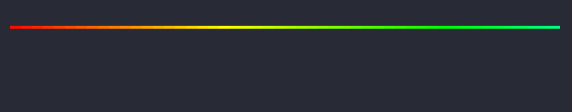

# Getting Started

Mordant is split into a number of modules to allow you to pick the functionality you need. On JVM,
there are several modules that implement `TerminalInterface` using different dependencies.

=== "All-in-one gradle dependencies"
    ```kotlin
    // Adds all JVM interface modules
    implementation("com.github.ajalt.mordant:mordant:$mordantVersion")
    
    // optional extensions for running animations with coroutines
    implementation("com.github.ajalt.mordant:mordant-coroutines:$mordantVersion")
    
    // optional widget for rendering Markdown
    implementation("com.github.ajalt.mordant:mordant-markdown:$mordantVersion")
    ```

=== "Individual JVM gradle dependencies"
    ```kotlin
    // This modules doesn't include any JVM interface modules, so you'll need one or more if you're 
    // targeting JVM
    implementation("com.github.ajalt.mordant:mordant-core:$mordantVersion")
    
    // This module uses the Java Foreign Function and Memory API. It requires JDK 22+, and you must 
    // add `--enable-native-access=ALL-UNNAMED` to your `java` command line arguments.
    implementation("com.github.ajalt.mordant:mordant-jvm-ffm:$mordantVersion")
    
    // This module uses the Java Native Access library. It supports all versions of Java, but 
    // requires linking to a bundled native library, so it increases your JAR size.
    implementation("com.github.ajalt.mordant:mordant-jvm-jna:$mordantVersion")
    
    // This module uses the GraalVM Native Image FFI interface. This only supports Graal Native Image.
    implementation("com.github.ajalt.mordant:mordant-jvm-graal-ffi:$mordantVersion")
    
    // optional extensions for running animations with coroutines
    implementation("com.github.ajalt.mordant:mordant-coroutines:$mordantVersion")
    
    // optional widget for rendering Markdown
    implementation("com.github.ajalt.mordant:mordant-markdown:$mordantVersion")
    ```


## Text Colors and Styles

Create a [Terminal] instance, and import any enum entries you want from [TextColors] and
[TextStyles]. The [println] function on your `Terminal` will detect your current terminal
capabilities and automatically downsample colors if necessary.

Use [`color.bg`][color.bg] to create a background color, or [`color1 on color2`][color.on] to
combine a foreground and background.

=== "Code"
    ```kotlin
    import com.github.ajalt.mordant.rendering.TextColors.*
    import com.github.ajalt.mordant.rendering.TextStyles.*
    import com.github.ajalt.mordant.terminal.Terminal
    import com.github.ajalt.mordant.rendering.TextColors.Companion.rgb
    
    val t = Terminal()
    t.println(brightRed("You can use any of the standard ANSI colors"))
    
    val style = (bold + black + strikethrough)
    t.println(
        cyan("You ${(green on white)("can ${style("nest")} styles")} arbitrarily")
    )
    
    t.println(rgb("#b4eeb4")("You can also use true color and color spaces like HSL"))
    ```

=== "Output"
    <div style="border-radius: 8px;width: fit-content;padding: 0.5em 1em;filter: drop-shadow(0.5em 0.5em 0.5em black);background-color: rgb(12 12 12);">
    <div style="margin: -0.5em 0px;font-size: 2em"><span style="color: #ff5f56;">●&nbsp;</span><span style="color: #ffbd2e">●&nbsp;</span><span style="color: #27c93f">●&nbsp;</span></div>
    <pre>
    <span style="color: #e74856">You</span><span style="color: #e74856"> </span><span style="color: #e74856">can</span><span style="color: #e74856"> </span><span style="color: #e74856">use</span><span style="color: #e74856"> </span><span style="color: #e74856">any</span><span style="color: #e74856"> </span><span style="color: #e74856">of</span><span style="color: #e74856"> </span><span style="color: #e74856">the</span><span style="color: #e74856"> </span><span style="color: #e74856">standard</span><span style="color: #e74856"> </span><span style="color: #e74856">ANSI</span><span style="color: #e74856"> </span><span style="color: #e74856">colors</span>
    <span style="color: #3a96dd">You</span><span style="color: #3a96dd"> </span><span style="color: #2fb479; background-color: #c0c0c0">can</span><span style="color: #2fb479; background-color: #c0c0c0"> </span><span style="color: #767676; background-color: #c0c0c0; font-weight: bold; text-decoration: line-through">nest</span><span style="color: #2fb479; background-color: #c0c0c0"> </span><span style="color: #2fb479; background-color: #c0c0c0">styles</span><span style="color: #3a96dd"> </span><span style="color: #3a96dd">arbitrarily</span>
    <span style="color: #b4eeb4">You</span><span style="color: #b4eeb4"> </span><span style="color: #b4eeb4">can</span><span style="color: #b4eeb4"> </span><span style="color: #b4eeb4">also</span><span style="color: #b4eeb4"> </span><span style="color: #b4eeb4">use</span><span style="color: #b4eeb4"> </span><span style="color: #b4eeb4">true</span><span style="color: #b4eeb4"> </span><span style="color: #b4eeb4">color</span><span style="color: #b4eeb4"> </span><span style="color: #b4eeb4">and</span><span style="color: #b4eeb4"> </span><span style="color: #b4eeb4">other</span><span style="color: #b4eeb4"> </span><span style="color: #b4eeb4">color</span><span style="color: #b4eeb4"> </span><span style="color: #b4eeb4">spaces</span><span style="color: #b4eeb4"> </span><span style="color: #b4eeb4">like</span><span style="color: #b4eeb4"> </span><span style="color: #b4eeb4">HSL</span>
    </pre>
    </div>

## Terminal color support detection

By default, `Terminal()` will try to detect ANSI support in the current stdout stream. If you'd
like to override the detection, you can pass a specific value to the [Terminal] constructor.

For example, to always output ANSI RGB color codes, even if stdout is currently directed to a file,
you can do this:

```kotlin
Terminal(AnsiLevel.TRUECOLOR)
```

## Text Wrapping and Alignment

`Terminal.println` will preserve whitespace by default, but you can use the [`Text`][Text] widget
for more advanced formatting. You can use the [Whitespace], [TextAlign], and [OverflowWrap] enums to
format text. They behave similar to the CSS properties of the same names.

### Text Wrapping

Pass one of the [Whitespace] values to the `Text` constructor to control how whitespace is handled.
You can also set a `width` to wrap the text to a specific width rather than the terminal width.

=== "Code"
    ```kotlin
    val text = """
    This is a long line {
        This line is indented
    }
    """.trimIndent()

    for (entry in Whitespace.entries) {
        terminal.println(
            Panel(
                content = Text(text, whitespace = entry, width = 17),
                title = Text(entry.name)
            )
        )
    }
    ```

=== "Output"

    <div style="border-radius: 8px;width: fit-content;padding: 0.5em 1em;filter: drop-shadow(0.5em 0.5em 0.5em black);background-color: rgb(12 12 12);">
    <div style="margin: -0.5em 0px;font-size: 2em"><span style="color: #ff5f56;">●&nbsp;</span><span style="color: #ffbd2e">●&nbsp;</span><span style="color: #27c93f">●&nbsp;</span></div>
    <pre style="font-family: monospace">
    <span>╭──── NORMAL ────╮</span>
    <span>│This is a long  │</span>
    <span>│line { This line│</span>
    <span>│is indented }   │</span>
    <span>╰────────────────╯</span>
    <span>╭────────────────── NOWRAP ───────────────────╮</span>
    <span>│This is a long line { This line is indented }│</span>
    <span>╰─────────────────────────────────────────────╯</span>
    <span>╭────────── PRE ──────────╮</span>
    <span>│This is a long line {    │</span>
    <span>│    This line is indented│</span>
    <span>│}                        │</span>
    <span>╰─────────────────────────╯</span>
    <span>╭─── PRE_WRAP ───╮</span>
    <span>│This is a long  │</span>
    <span>│line {          │</span>
    <span>│    This line is│</span>
    <span>│indented        │</span>
    <span>│}               │</span>
    <span>╰────────────────╯</span>
    <span>╭── PRE_LINE ──╮</span>
    <span>│This is a long│</span>
    <span>│line {        │</span>
    <span>│This line is  │</span>
    <span>│indented      │</span>
    <span>│}             │</span>
    <span>╰──────────────╯</span>
    </pre>
    </div>

!!! tip
    You can format styled text too.

    ```kotlin
    Text(red("Hello, world!"), whitespace = NORMAL)
    ```

### Text Alignment

You can use the [TextAlign] values to align or justify text.

=== "Code"
    ```kotlin
    for (entry in TextAlign.entries) {
        terminal.println(
            Text(
                (black on blue)("align = ${entry.name}"),
                align = entry, width = 20
            ),
        )
    }
    ```

=== "Output"
    <div style="border-radius: 8px;width: fit-content;padding: 0.5em 1em;filter: drop-shadow(0.5em 0.5em 0.5em black);background-color: rgb(12 12 12);">
    <div style="margin: -0.5em 0px;font-size: 2em"><span style="color: #ff5f56;">●&nbsp;</span><span style="color: #ffbd2e">●&nbsp;</span><span style="color: #27c93f">●&nbsp;</span></div>
    <pre style="font-family: monospace">
    <span style="color: #000000; background-color: #61afef">align = LEFT        </span>
    <span style="color: #000000; background-color: #61afef">       align = RIGHT</span>
    <span style="color: #000000; background-color: #61afef">   align = CENTER   </span>
    <span style="color: #000000; background-color: #61afef">align   =    JUSTIFY</span>
    <span style="color: #000000; background-color: #61afef">align = NONE</span>
    </pre>
    </div>


### Text Overflow

If you are wrapping text that has long words that exceed the line length by themselves, you can use
the [OverflowWrap] enum to control how they are handled.

=== "Code"
    ```kotlin
    for (entry in OverflowWrap.entries) {
        terminal.println(
            Panel(
                content = Text(
                    "overflow_wrap",
                    whitespace = Whitespace.NORMAL,
                    overflowWrap = entry,
                    width = 8
                ),
                title = Text(entry.name)
            )
        )
    }
    ```

=== "Output"
    <div style="border-radius: 8px;width: fit-content;padding: 0.5em 1em;filter: drop-shadow(0.5em 0.5em 0.5em black);background-color: rgb(12 12 12);">
    <div style="margin: -0.5em 0px;font-size: 2em"><span style="color: #ff5f56;">●&nbsp;</span><span style="color: #ffbd2e">●&nbsp;</span><span style="color: #27c93f">●&nbsp;</span></div>
    <pre style="font-family: monospace">
    <span>╭── NORMAL ───╮</span>
    <span>│overflow_wrap│</span>
    <span>╰─────────────╯</span>
    <span>╭ BREAK_WORD ─╮</span>
    <span>│overflow     │</span>
    <span>│_wrap        │</span>
    <span>╰─────────────╯</span>
    <span>╭─ TRUNCATE ──╮</span>
    <span>│overflow     │</span>
    <span>╰─────────────╯</span>
    <span>╭─ ELLIPSES ──╮</span>
    <span>│overflo…     │</span>
    <span>╰─────────────╯</span>
    </pre>
    </div>

!!! note
    `OverflowWrap` has no effect when used with `Whitespace.PRE` or `Whitespace.NOWRAP`.

## Tables

Use the [table] DSL to define table widgets.

=== "Code"
    ```kotlin
    t.println(table {
        header { row("Column 1", "Column 2") }
        body { row("1", "2") }
    })
    ```

=== "Output"
    <div style="border-radius: 8px;width: fit-content;padding: 0.5em 1em;filter: drop-shadow(0.5em 0.5em 0.5em black);background-color: rgb(12 12 12);">
    <div style="margin: -0.5em 0px;font-size: 2em"><span style="color: #ff5f56;">●&nbsp;</span><span style="color: #ffbd2e">●&nbsp;</span><span style="color: #27c93f">●&nbsp;</span></div>
    <pre style="font-family: monospace;line-height: 1.1;">
    <span>┌──────────┬──────────┐</span>
    <span>│</span><span> </span><span>Column</span><span> </span><span>1</span><span> </span><span>│</span><span> </span><span>Column</span><span> </span><span>2</span><span> </span><span>│</span>
    <span>├──────────┼──────────┤</span>
    <span>│</span><span> </span><span>1</span><span>        </span><span>│</span><span> </span><span>2</span><span>        </span><span>│</span>
    <span>└──────────┴──────────┘</span>
    </pre>
    </div>

Mordant gives you lots of customization for your tables, including striped row styles, row and
column spans, and different border styles.

=== "Output"
    <div style="border-radius: 8px;width: fit-content;padding: 0.5em 1em;filter: drop-shadow(0.5em 0.5em 0.5em black);background-color: rgb(12 12 12);">
    <div style="margin: -0.5em 0px;font-size: 2em"><span style="color: #ff5f56;">●&nbsp;</span><span style="color: #ffbd2e">●&nbsp;</span><span style="color: #27c93f">●&nbsp;</span></div>
    <pre style="font-family: monospace;line-height: 1.1;">
    <span>                                                            </span><span style="color: #e74856; font-weight: bold">  </span><span style="color: #e74856; font-weight: bold">Percent</span><span style="color: #e74856; font-weight: bold"> </span><span style="color: #e74856; font-weight: bold">Change</span><span style="color: #e74856; font-weight: bold">  </span>
    <span>                              </span><span style="color: #e74856; font-weight: bold">    </span><span style="color: #e74856; font-weight: bold">2020</span><span style="color: #e74856; font-weight: bold"> </span><span> </span><span style="color: #e74856; font-weight: bold">    </span><span style="color: #e74856; font-weight: bold">2021</span><span style="color: #e74856; font-weight: bold"> </span><span> </span><span style="color: #e74856; font-weight: bold">    </span><span style="color: #e74856; font-weight: bold">2022</span><span style="color: #e74856; font-weight: bold"> </span><span> </span><span style="color: #e74856; font-weight: bold"> </span><span style="color: #e74856; font-weight: bold">2020-21</span><span style="color: #e74856; font-weight: bold">  </span><span style="color: #e74856; font-weight: bold">2021-21</span><span style="color: #e74856; font-weight: bold"> </span>
    <span style="color: #4b25b9">═════════════════════════════╤═════════════════════════════╤══════════════════</span>
    <span style="color: #3b78ff"> </span><span style="color: #3b78ff">Average</span><span style="color: #3b78ff"> </span><span style="color: #3b78ff">income</span><span style="color: #3b78ff"> </span><span style="color: #3b78ff">before</span><span style="color: #3b78ff"> </span><span style="color: #3b78ff">taxes</span><span style="color: #3b78ff"> </span><span style="color: #4b25b9">│</span><span style="color: #2fb479"> </span><span style="color: #2fb479">$84,352</span><span style="color: #2fb479"> </span><span> </span><span style="color: #2fb479"> </span><span style="color: #2fb479">$87,432</span><span style="color: #2fb479"> </span><span> </span><span style="color: #2fb479"> </span><span style="color: #2fb479">$94,003</span><span style="color: #2fb479"> </span><span style="color: #4b25b9">│</span><span style="color: #3b78ff">     </span><span style="color: #3b78ff">3.7</span><span style="color: #3b78ff">      </span><span style="color: #3b78ff">7.5</span><span style="color: #3b78ff"> </span>
    <span style="color: #4b25b9">─────────────────────────────┼─────────────────────────────┼──────────────────</span>
    <span style="color: #3b78ff; opacity: 0.5"> </span><span style="color: #3b78ff; opacity: 0.5">Average</span><span style="color: #3b78ff; opacity: 0.5"> </span><span style="color: #3b78ff; opacity: 0.5">annual</span><span style="color: #3b78ff; opacity: 0.5"> </span><span style="color: #3b78ff; opacity: 0.5">expenditures</span><span style="color: #3b78ff; opacity: 0.5"> </span><span style="color: #4b25b9">│</span><span style="color: #2fb479; opacity: 0.5"> </span><span style="color: #2fb479; opacity: 0.5">$61,332</span><span style="color: #2fb479; opacity: 0.5"> </span><span> </span><span style="color: #2fb479; opacity: 0.5"> </span><span style="color: #2fb479; opacity: 0.5">$66,928</span><span style="color: #2fb479; opacity: 0.5"> </span><span> </span><span style="color: #2fb479; opacity: 0.5"> </span><span style="color: #2fb479; opacity: 0.5">$72,967</span><span style="color: #2fb479; opacity: 0.5"> </span><span style="color: #4b25b9">│</span><span style="color: #3b78ff; opacity: 0.5">     </span><span style="color: #3b78ff; opacity: 0.5">9.1</span><span style="color: #3b78ff; opacity: 0.5">      </span><span style="color: #3b78ff; opacity: 0.5">9.0</span><span style="color: #3b78ff; opacity: 0.5"> </span>
    <span style="color: #4b25b9">─────────────────────────────┼─────────────────────────────┼──────────────────</span>
    <span style="color: #3b78ff">   </span><span style="color: #3b78ff">Food</span><span style="color: #3b78ff">                      </span><span style="color: #4b25b9">│</span><span style="color: #2fb479">   </span><span style="color: #2fb479">7,310</span><span style="color: #2fb479"> </span><span> </span><span style="color: #2fb479">   </span><span style="color: #2fb479">8,289</span><span style="color: #2fb479"> </span><span> </span><span style="color: #2fb479">   </span><span style="color: #2fb479">9,343</span><span style="color: #2fb479"> </span><span style="color: #4b25b9">│</span><span style="color: #3b78ff">    </span><span style="color: #3b78ff">13.4</span><span style="color: #3b78ff">     </span><span style="color: #3b78ff">12.7</span><span style="color: #3b78ff"> </span>
    <span style="color: #4b25b9">─────────────────────────────┼─────────────────────────────┼──────────────────</span>
    <span style="color: #3b78ff; opacity: 0.5">   </span><span style="color: #3b78ff; opacity: 0.5">Housing</span><span style="color: #3b78ff; opacity: 0.5">                   </span><span style="color: #4b25b9">│</span><span style="color: #2fb479; opacity: 0.5">  </span><span style="color: #2fb479; opacity: 0.5">21,417</span><span style="color: #2fb479; opacity: 0.5"> </span><span> </span><span style="color: #2fb479; opacity: 0.5">  </span><span style="color: #2fb479; opacity: 0.5">22,624</span><span style="color: #2fb479; opacity: 0.5"> </span><span> </span><span style="color: #2fb479; opacity: 0.5">  </span><span style="color: #2fb479; opacity: 0.5">24,298</span><span style="color: #2fb479; opacity: 0.5"> </span><span style="color: #4b25b9">│</span><span style="color: #3b78ff; opacity: 0.5">     </span><span style="color: #3b78ff; opacity: 0.5">5.6</span><span style="color: #3b78ff; opacity: 0.5">      </span><span style="color: #3b78ff; opacity: 0.5">7.4</span><span style="color: #3b78ff; opacity: 0.5"> </span>
    <span style="color: #4b25b9">─────────────────────────────┼─────────────────────────────┼──────────────────</span>
    <span style="color: #3b78ff">   </span><span style="color: #3b78ff">Apparel</span><span style="color: #3b78ff"> </span><span style="color: #3b78ff">and</span><span style="color: #3b78ff"> </span><span style="color: #3b78ff">services</span><span style="color: #3b78ff">      </span><span style="color: #4b25b9">│</span><span style="color: #2fb479">   </span><span style="color: #2fb479">1,434</span><span style="color: #2fb479"> </span><span> </span><span style="color: #2fb479">   </span><span style="color: #2fb479">1,754</span><span style="color: #2fb479"> </span><span> </span><span style="color: #2fb479">   </span><span style="color: #2fb479">1,945</span><span style="color: #2fb479"> </span><span style="color: #4b25b9">│</span><span style="color: #3b78ff">    </span><span style="color: #3b78ff">22.3</span><span style="color: #3b78ff">     </span><span style="color: #3b78ff">10.9</span><span style="color: #3b78ff"> </span>
    <span style="color: #4b25b9">─────────────────────────────┼─────────────────────────────┼──────────────────</span>
    <span style="color: #3b78ff; opacity: 0.5">   </span><span style="color: #3b78ff; opacity: 0.5">Transportation</span><span style="color: #3b78ff; opacity: 0.5">            </span><span style="color: #4b25b9">│</span><span style="color: #2fb479; opacity: 0.5">   </span><span style="color: #2fb479; opacity: 0.5">9,826</span><span style="color: #2fb479; opacity: 0.5"> </span><span> </span><span style="color: #2fb479; opacity: 0.5">  </span><span style="color: #2fb479; opacity: 0.5">10,961</span><span style="color: #2fb479; opacity: 0.5"> </span><span> </span><span style="color: #2fb479; opacity: 0.5">  </span><span style="color: #2fb479; opacity: 0.5">12,295</span><span style="color: #2fb479; opacity: 0.5"> </span><span style="color: #4b25b9">│</span><span style="color: #3b78ff; opacity: 0.5">    </span><span style="color: #3b78ff; opacity: 0.5">11.6</span><span style="color: #3b78ff; opacity: 0.5">     </span><span style="color: #3b78ff; opacity: 0.5">12.2</span><span style="color: #3b78ff; opacity: 0.5"> </span>
    <span style="color: #4b25b9">─────────────────────────────┼─────────────────────────────┼──────────────────</span>
    <span style="color: #3b78ff">   </span><span style="color: #3b78ff">Healthcare</span><span style="color: #3b78ff">                </span><span style="color: #4b25b9">│</span><span style="color: #2fb479">   </span><span style="color: #2fb479">5,177</span><span style="color: #2fb479"> </span><span> </span><span style="color: #2fb479">   </span><span style="color: #2fb479">5,452</span><span style="color: #2fb479"> </span><span> </span><span style="color: #2fb479">   </span><span style="color: #2fb479">5,850</span><span style="color: #2fb479"> </span><span style="color: #4b25b9">│</span><span style="color: #3b78ff">     </span><span style="color: #3b78ff">5.3</span><span style="color: #3b78ff">      </span><span style="color: #3b78ff">7.3</span><span style="color: #3b78ff"> </span>
    <span style="color: #4b25b9">─────────────────────────────┼─────────────────────────────┼──────────────────</span>
    <span style="color: #3b78ff; opacity: 0.5">   </span><span style="color: #3b78ff; opacity: 0.5">Entertainment</span><span style="color: #3b78ff; opacity: 0.5">             </span><span style="color: #4b25b9">│</span><span style="color: #2fb479; opacity: 0.5">   </span><span style="color: #2fb479; opacity: 0.5">2,909</span><span style="color: #2fb479; opacity: 0.5"> </span><span> </span><span style="color: #2fb479; opacity: 0.5">   </span><span style="color: #2fb479; opacity: 0.5">3,568</span><span style="color: #2fb479; opacity: 0.5"> </span><span> </span><span style="color: #2fb479; opacity: 0.5">   </span><span style="color: #2fb479; opacity: 0.5">3,458</span><span style="color: #2fb479; opacity: 0.5"> </span><span style="color: #4b25b9">│</span><span style="color: #3b78ff; opacity: 0.5">    </span><span style="color: #3b78ff; opacity: 0.5">22.7</span><span style="color: #3b78ff; opacity: 0.5">     </span><span style="color: #3b78ff; opacity: 0.5">-3.1</span><span style="color: #3b78ff; opacity: 0.5"> </span>
    <span style="color: #4b25b9">─────────────────────────────┼─────────────────────────────┼──────────────────</span>
    <span style="color: #3b78ff">   </span><span style="color: #3b78ff">Education</span><span style="color: #3b78ff">                 </span><span style="color: #4b25b9">│</span><span style="color: #2fb479">   </span><span style="color: #2fb479">1,271</span><span style="color: #2fb479"> </span><span> </span><span style="color: #2fb479">   </span><span style="color: #2fb479">1,226</span><span style="color: #2fb479"> </span><span> </span><span style="color: #2fb479">   </span><span style="color: #2fb479">1,335</span><span style="color: #2fb479"> </span><span style="color: #4b25b9">│</span><span style="color: #3b78ff">    </span><span style="color: #3b78ff">-3.5</span><span style="color: #3b78ff">      </span><span style="color: #3b78ff">8.9</span><span style="color: #3b78ff"> </span>
    <span style="color: #4b25b9">═════════════════════════════╪═════════╤═════════╤═════════╪══════════════════</span>
    <span style="color: #2fb479; font-style: italic">            </span><span style="color: #2fb479; font-style: italic">Remaining</span><span style="color: #2fb479; font-style: italic"> </span><span style="color: #2fb479; font-style: italic">income</span><span style="color: #2fb479; font-style: italic"> </span><span style="color: #4b25b9">│</span><span style="color: #2fb479; font-style: italic"> </span><span style="color: #2fb479; font-style: italic">$23,020</span><span style="color: #2fb479; font-style: italic"> </span><span style="color: #4b25b9">│</span><span style="color: #2fb479; font-style: italic"> </span><span style="color: #2fb479; font-style: italic">$20,504</span><span style="color: #2fb479; font-style: italic"> </span><span style="color: #4b25b9">│</span><span style="color: #2fb479; font-style: italic"> </span><span style="color: #2fb479; font-style: italic">$21,036</span><span style="color: #2fb479; font-style: italic"> </span><span style="color: #4b25b9">│</span><span>                  </span>
    <span style="opacity: 0.5">                     </span><span style="opacity: 0.5">via</span><span style="opacity: 0.5"> </span><span style="opacity: 0.5">U.S.</span><span style="opacity: 0.5"> </span><span style="opacity: 0.5">Bureau</span><span style="opacity: 0.5"> </span><span style="opacity: 0.5">of</span><span style="opacity: 0.5"> </span><span style="opacity: 0.5">Labor</span><span style="opacity: 0.5"> </span><span style="opacity: 0.5">Statistics</span><span style="opacity: 0.5">                      </span>
    </pre>
    </div>

=== "Code"
    ```kotlin
    table {
        borderType = SQUARE_DOUBLE_SECTION_SEPARATOR
        borderStyle = rgb("#4b25b9")
        align = RIGHT
        tableBorders = NONE
        header {
            style = brightRed + bold
            row {
                cellBorders = NONE
                cells("", "", "", "")
                cell("Percent Change") {
                    columnSpan = 2
                    align = CENTER
                }
            }
            row("", "2020", "2021", "2022", "2020-21", "2021-21") { cellBorders = BOTTOM }
        }
        body {
            style = green
            column(0) {
                align = LEFT
                cellBorders = ALL
                style = brightBlue
            }
            column(4) {
                cellBorders = LEFT_BOTTOM
                style = brightBlue
            }
            column(5) {
                style = brightBlue
            }
            rowStyles(TextStyle(), dim.style)
            cellBorders = TOP_BOTTOM
            row("Average income before taxes", "$84,352", "$87,432", "$94,003", "3.7", "7.5")
            row("Average annual expenditures", "$61,332", "$66,928", "$72,967", "9.1", "9.0")
            row("  Food", "7,310", "8,289", "9,343", "13.4", "12.7")
            row("  Housing", "21,417", "22,624", "24,298", "5.6", "7.4")
            row("  Apparel and services", "1,434", "1,754", "1,945", "22.3", "10.9")
            row("  Transportation", "9,826", "10,961", "12,295", "11.6", "12.2")
            row("  Healthcare", "5,177", "5,452", "5,850", "5.3", "7.3")
            row("  Entertainment", "2,909", "3,568", "3,458", "22.7", "-3.1")
            row("  Education", "1,271", "1,226", "1,335", "-3.5", "8.9")
        }
        footer {
            style(italic = true)
            row {
                cells("Remaining income", "$23,020", "$20,504", "$21,036")
            }
        }
        captionBottom(dim("via U.S. Bureau of Labor Statistics"))
    }
    ```

## Layout

If you need to lay out multiple widgets or strings, you can use the [grid] builder, which has an API
similar to `table`, but doesn't apply styling by default
=== "Code"
    ```kotlin
    grid {
        row("Grid Builder", "Supports", "Alignment")
        row {
            cell("Left") { align = LEFT }
            cell("Center") { align = CENTER }
            cell("Right") { align = RIGHT }
        }
    }
    ```

=== "Output"
    <div style="border-radius: 8px;width: fit-content;padding: 0.5em 1em;filter: drop-shadow(0.5em 0.5em 0.5em black);background-color: rgb(12 12 12);">
    <div style="margin: -0.5em 0px;font-size: 2em"><span style="color: #ff5f56;">●&nbsp;</span><span style="color: #ffbd2e">●&nbsp;</span><span style="color: #27c93f">●&nbsp;</span></div>
    <pre style="font-family: monospace">
    <span>Grid</span><span> </span><span>Builder</span><span> </span><span>Supports</span><span> </span><span>Alignment</span>
    <span>Left</span><span>          </span><span>Center</span><span>      </span><span>Right</span>
    </pre>
    </div>

There are also the [horizontalLayout] and [verticalLayout] builders if you don't need a full grid.


=== "Code"
    ```kotlin
    horizontalLayout {
        cell("Spinner:")
        cell(Spinner.Dots(initial = 2))
    }
    ```

=== "Output"
    <div style="border-radius: 8px;width: fit-content;padding: 0.5em 1em;filter: drop-shadow(0.5em 0.5em 0.5em black);background-color: rgb(12 12 12);">
    <div style="margin: -0.5em 0px;font-size: 2em"><span style="color: #ff5f56;">●&nbsp;</span><span style="color: #ffbd2e">●&nbsp;</span><span style="color: #27c93f">●&nbsp;</span></div>
    <pre style="font-family: monospace">
    <span>Spinner:</span><span> </span><span>⠹</span>
    </pre>
    </div>

## Controlling the cursor

You can show and hide the cursor, move it around, and clear parts of the screen with the [cursor]
property on `Terminal`. If your terminal doesn't support cursor movements (like when output is
redirected to a file) these commands are no-ops.

```kotlin
val t = Terminal()
t.cursor.move {
    up(3)
    startOfLine()
    clearScreenAfterCursor()
}
t.cursor.hide(showOnExit = true)
```

## Animations

You can animate any widget like a table with [Terminal.animation], or any regular
string with [Terminal.textAnimation]. For progress bar animations, see [the docs on progress
bars](progress.md).

=== "Code"
    ```kotlin
    val terminal = Terminal()
    val a = terminal.textAnimation<Int> { frame ->
        (1..50).joinToString("") {
            val hue = (frame + it) * 3 % 360
            TextColors.hsv(hue, 1, 1)("━")
        }
    }
    
    terminal.cursor.hide(showOnExit = true)
    repeat(120) {
        a.update(it)
        Thread.sleep(25)
    }
    ```

=== "Output"

    

!!! tip

    If you have an `animation<Unit>` or `textAnimation<Unit>`, you can refresh them automatically with
    [animateOnThread] or [animateOnCoroutine].

## Prompting for input

You can ask the user to enter text and wait for a response with [Terminal.prompt]:

=== "Code"
    ```kotlin
    val t = Terminal()
    val response = t.prompt("Choose a size", choices=listOf("small", "large"))
    t.println("You chose: $response")
    ```

=== "Output"
    ```text
    $ ./example
    Choose a size [small, large]: small
    You chose: small
    ```

You can customize the prompt behavior further or convert the response to other types
creating a subclass of the [Prompt] class. Mordant includes [StringPrompt], [YesNoPrompt], and
[ConfirmationPrompt] classes for common use cases.


[ConfirmationPrompt]:       api/mordant/com.github.ajalt.mordant.terminal/-confirmation-prompt/index.html
[OverflowWrap]:             api/mordant/com.github.ajalt.mordant.rendering/-overflow-wrap/index.html
[Prompt]:                   api/mordant/com.github.ajalt.mordant.terminal/-prompt/index.html
[README]:                   https://github.com/ajalt/mordant
[StringPrompt]:             api/mordant/com.github.ajalt.mordant.terminal/-string-prompt/index.html
[Terminal.animation]:       api/mordant/com.github.ajalt.mordant.animation/animation.html
[Terminal.prompt]:          api/mordant/com.github.ajalt.mordant.terminal/-terminal/prompt.html
[Terminal.textAnimation]:   api/mordant/com.github.ajalt.mordant.animation/text-animation.html
[Terminal]:                 api/mordant/com.github.ajalt.mordant.terminal/-terminal/index.html
[TextAlign]:                api/mordant/com.github.ajalt.mordant.rendering/-text-align/index.html
[TextColors]:               api/mordant/com.github.ajalt.mordant.rendering/-text-colors/index.html
[TextStyles]:               api/mordant/com.github.ajalt.mordant.rendering/-text-styles/index.html
[Text]:                     api/mordant/com.github.ajalt.mordant.widgets/-text/index.html
[Whitespace]:               api/mordant/com.github.ajalt.mordant.rendering/-whitespace/index.html
[YesNoPrompt]:              api/mordant/com.github.ajalt.mordant.terminal/-yes-no-prompt/index.html
[animateOnCoroutine]:       api/extensions/mordant-coroutines/com.github.ajalt.mordant.animation.coroutines/animate-in-coroutine.html
[animateOnThread]:          api/mordant/com.github.ajalt.mordant.animation.progress/animate-on-thread.html
[color.bg]:                 api/mordant/com.github.ajalt.mordant.rendering/-text-style/bg.html
[color.on]:                 api/mordant/com.github.ajalt.mordant.rendering/-text-style/on.html
[cursor]:                   api/mordant/com.github.ajalt.mordant.terminal/-terminal/cursor.html
[grid]:                     api/mordant/com.github.ajalt.mordant.table/grid.html
[horizontalLayout]:         api/mordant/com.github.ajalt.mordant.table/horizontal-layout.html
[println]:                  api/mordant/com.github.ajalt.mordant.terminal/-terminal/println.html
[progress.advance]:         api/mordant/com.github.ajalt.mordant.animation/-progress-animation/advance.html
[progress.build]:           api/mordant/com.github.ajalt.mordant.widgets/-progress-layout/build.html
[progress.start]:           api/mordant/com.github.ajalt.mordant.animation/-progress-animation/start.html
[progress.update]:          api/mordant/com.github.ajalt.mordant.animation/-progress-animation/update.html
[progressAnimation]:        api/mordant/com.github.ajalt.mordant.animation/progress-animation.html
[table]:                    api/mordant/com.github.ajalt.mordant.table/table.html
[verticalLayout]:           api/mordant/com.github.ajalt.mordant.table/vertical-layout.html
