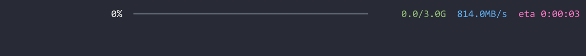
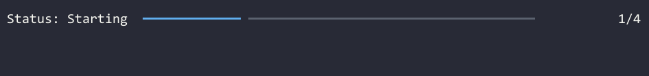
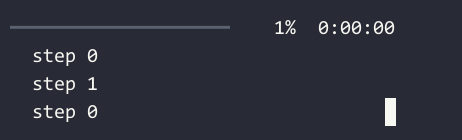
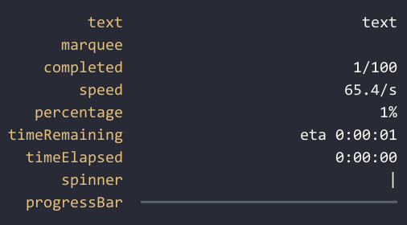

# Progress Bars

Mordant provides a simple way to create animated progress bars in your terminal.

# Basic Usage

You can use the [progressBarLayout] DSL to define the layout of your progress bar. Then you
can start the animation either on a thread with [animateOnThread], or
using coroutines with [animateOnCoroutine].`animateOnThread` is JVM-only, but `animateOnCoroutine`
is available on all platforms using the `mordant-coroutines` module.

Once the animation is started, you can update the progress bar by calling [update] and [advance].

=== "Example with Coroutines"

    ```kotlin
    val progress = progressBarLayout {
        marquee(terminal.theme.warning("my-file-download.bin"), width = 15)
        percentage()
        progressBar()
        completed(style = terminal.theme.success)
        speed("B/s", style = terminal.theme.info)
        timeRemaining(style = magenta)
    }.animateInCoroutine(terminal)

    launch { progress.execute() }

    // Update the progress as the download progresses
    progress.update { total = 3_000_000_000 }
    while (!progress.finished) {
        progress.advance(15_000_000)
        Thread.sleep(100)
    }
    ```

=== "Example with Threads"

    ```kotlin
    val progress = progressBarLayout {
        marquee(terminal.theme.warning("my-file-download.bin"), width = 15)
        percentage()
        progressBar()
        completed(style = terminal.theme.success)
        speed("B/s", style = terminal.theme.info)
        timeRemaining(style = magenta)
    }.animateOnThread(terminal)
    
    val future = progress.execute()
    
    // Update the progress as the download progresses
    progress.update { total = 3_000_000_000 }
    while (!progress.finished) {
        progress.advance(15_000_000)
        Thread.sleep(100)
    }
    
    // Optional: wait for the future to complete so that the final frame of the
    // animation is rendered before the program exits.
    future.get()
    ```

=== "Output"

    

# Changing Text While Animation is Running

You can pass data to the progress bar by using [progressBarContextLayout], which allows you to
set a [context][ProgressTaskUpdateScope.context] value that your progress bar can use to render
dynamic text.

=== "Example with Context"

    ```kotlin
    val progress = progressBarContextLayout<String> {
        text { "Status: $context" }
        progressBar()
        completed()
    }.animateInCoroutine(terminal, context = "Starting", total = 4, completed = 1)

    launch { progress.execute() }

    val states = listOf("Downloading", "Extracting", "Done")
    for (state in states) {
        delay(2.seconds)
        progress.update {
            context = state
            completed += 1
        }
    }
    ```

=== "Output"

    

!!! tip

    If you want a builder instead of a DSL, you can use the [ProgressLayoutBuilder]

# Multiple Progress Bars

You can create multiple progress bars running at the same time using [MultiProgressBarAnimation].
Call [addTask] for each progress bar you want, passing in the layout for that bar. You can 
use the same layout for multiple tasks, or different layouts for some of them.

You can call [advance] and [update] on each task to update them separately.

The columns of the progress bars will have their widths aligned to the same size by default,
but you can change this by setting the `alignColumns` parameter in the layout.

=== "Example with Multiple Progress Bars"

    ```kotlin
    val overallLayout = progressBarLayout(alignColumns = false) {
        progressBar(width = 20)
        percentage()
        timeElapsed(compact = false)
    }
    val taskLayout = progressBarContextLayout<Int> {
        text(fps = animationFps, align = TextAlign.LEFT) { "〉 step $context" }
    }

    val progress = MultiProgressBarAnimation(terminal).animateInCoroutine()
    val overall = progress.addTask(overallLayout, total = 100)
    val tasks = List(3) { progress.addTask(taskLayout, total = 1, completed = 1, context = 0) }

    launch { progress.execute() }

    for (i in 1..100) {
        overall.advance()
        tasks[i % 3].update { context = i }
        delay(100)
    }
    ```

=== "Output"

    

!!! tip

    The progress animation will keep running until all tasks are [finished]. If you want to stop sooner,
    you can set all the tasks' `completed` equal to their `total`, or cancel the coroutine scope or
    future that the animation is running in.

# Available Progress Bar Cell Types

Mordant provides several cell types that you can use to build your progress bar layouts, or you can
make your own with [cell] or [text].

=== "Output"

    

=== "Code"

    ```kotlin
    // Use a custom maker to build render the cells in a vertical definitionList
    object VerticalProgressBarMaker : ProgressBarWidgetMaker {
        override fun build(rows: List<ProgressBarMakerRow<*>>): Widget {
            return definitionList {
                inline = true
                val widgets = MultiProgressBarWidgetMaker.buildCells(rows)
                for ((term, desc) in widgets.flatten().windowed(2, 2)) {
                    entry(term, desc)
                }
            }
        }
    }

    val progress = progressBarLayout {
        text("text"); text("text")
        text("marquee"); marquee("marquee", width = 10, scrollWhenContentFits = true)
        text("completed"); completed()
        text("speed"); speed()
        text("percentage"); percentage()
        text("timeRemaining"); timeRemaining()
        text("timeElapsed"); timeElapsed()
        text("spinner"); spinner(Spinner.Lines())
        text("progressBar"); progressBar()
    }.animateOnThread(terminal, maker = VerticalProgressBarMaker)

    launch { progress.execute() }

    while (!progress.finished) {
        progress.advance()
        delay(100)
    }
    ```

| Cell Type       | Description                                                                                                                                                                                        |
|-----------------|----------------------------------------------------------------------------------------------------------------------------------------------------------------------------------------------------|
| [text]          | You can make a static text cell with `text("")`, or a dynamic one with `text {""}`                                                                                                                 |
| [marquee]       | A fixed-width text cell that scrolls its contents when they're larger than the cell. You can make the content always scroll by setting `scrollWhenContentFits=true`                                |
| [completed]     | A cell that shows the [completed] count and optionally the [total]. It uses SI units for amounts larger than 1000                                                                                  |
| [speed]         | A cell that shows the speed of the progress, in bytes per second.                                                                                                                                  |
| [percentage]    | A cell that shows the completed percentage.                                                                                                                                                        |
| [timeRemaining] | A cell that shows the estimated time remaining, or optionally the elapsed time once a task finishes. If you want a different time format, you can do `text { myFormat(calculateTimeRemaining()) }` |
| [timeElapsed]   | A cell that shows the elapsed time. If you want a different time format, you can do `text { myFormat(calculateTimeElapsed()) }`                                                                    |
| [spinner]       | A cell that shows an animated [Spinner].                                                                                                                                                           |
| [progressBar]   | A cell that shows a progress bar.                                                                                                                                                                  |
| [cell]          | A custom cell that can show any Widget                                                                                                                                                             |

# Animating on Custom Threads

If you want to run an animation on your own threading infrastructure instead of a Java Executor, there 
are a couple of ways to do it.

## With `runBlocking`

If you are on JVM, you can still use [animateOnThread], but call [BlockingAnimator.runBlocking] on
you own thread instead of using [execute].

For example, to run an animation with RxJava:

```kotlin
val progress = progressBarLayout { /* ... */ }.animateOnThread(terminal)
Completable.create { progress.runBlocking() }
    .subscribeOn(Schedulers.computation())
    .subscribe()
```

## Calling `refresh` manually

If you aren't on JVM or want even more control, you can create a [MultiProgressBarAnimation] and
call [refresh] manually each time you want a new frame to be rendered.

```kotlin
val layout = progressBarLayout { /* ... */ }
val animation = MultiProgressBarAnimation(terminal)
val task = animation.addTask(layout, total = 100)

while (!animation.finished) {
    task.advance()
    animation.refresh()
    sleep(33)
}

// Refresh all cells to draw the final frame
animation.refresh(refreshAll = true)
```


[BlockingAnimator.runBlocking]:    api/mordant/com.github.ajalt.mordant.animation.progress/-blocking-animator/run-blocking.html
[MultiProgressBarAnimation]:       api/mordant/com.github.ajalt.mordant.animation.progress/-multi-progress-bar-animation/index.html
[ProgressLayoutBuilder]:           api/mordant/com.github.ajalt.mordant.widgets.progress/-progress-layout-builder/index.html
[ProgressTaskUpdateScope.context]: api/mordant/com.github.ajalt.mordant.animation.progress/-progress-task-update-scope/context.html
[Spinner]:                         api/mordant/com.github.ajalt.mordant.widgets/-spinner/index.html
[addTask]:                         api/mordant/com.github.ajalt.mordant.animation.progress/-progress-bar-animation/add-task.html
[advance]:                         api/mordant/com.github.ajalt.mordant.animation.progress/advance.html
[animateOnCoroutine]:              api/extensions/mordant-coroutines/com.github.ajalt.mordant.animation.coroutines/animate-in-coroutine.html
[animateOnThread]:                 api/mordant/com.github.ajalt.mordant.animation.progress/animate-on-thread.html
[cell]:                            api/mordant/com.github.ajalt.mordant.widgets.progress/-progress-layout-scope/cell.html
[completed]:                       api/mordant/com.github.ajalt.mordant.animation.progress/-progress-task/completed.html
[execute]:                         api/mordant/com.github.ajalt.mordant.animation.progress/execute.html
[finished]:                        api/mordant/com.github.ajalt.mordant.animation.progress/-progress-task/finished.html
[marquee]:                         api/mordant/com.github.ajalt.mordant.widgets.progress/marquee.html
[percentage]:                      api/mordant/com.github.ajalt.mordant.widgets.progress/percentage.html
[progressBarContextLayout]:        api/mordant/com.github.ajalt.mordant.widgets.progress/progress-bar-context-layout.html
[progressBarLayout]:               api/mordant/com.github.ajalt.mordant.widgets.progress/progress-bar-layout.html
[progressBar]:                     api/mordant/com.github.ajalt.mordant.widgets.progress/progress-bar.html
[refresh]:                         api/mordant/com.github.ajalt.mordant.animation.progress/-progress-bar-animation/refresh.html
[speed]:                           api/mordant/com.github.ajalt.mordant.widgets.progress/speed.html
[spinner]:                         api/mordant/com.github.ajalt.mordant.widgets.progress/spinner.html
[text]:                            api/mordant/com.github.ajalt.mordant.widgets.progress/text.html
[timeElapsed]:                     api/mordant/com.github.ajalt.mordant.widgets.progress/time-elapsed.html
[timeRemaining]:                   api/mordant/com.github.ajalt.mordant.widgets.progress/time-remaining.html
[total]:                           api/mordant/com.github.ajalt.mordant.animation.progress/-progress-task/total.html
[update]:                          api/mordant/com.github.ajalt.mordant.animation.progress/update.html
